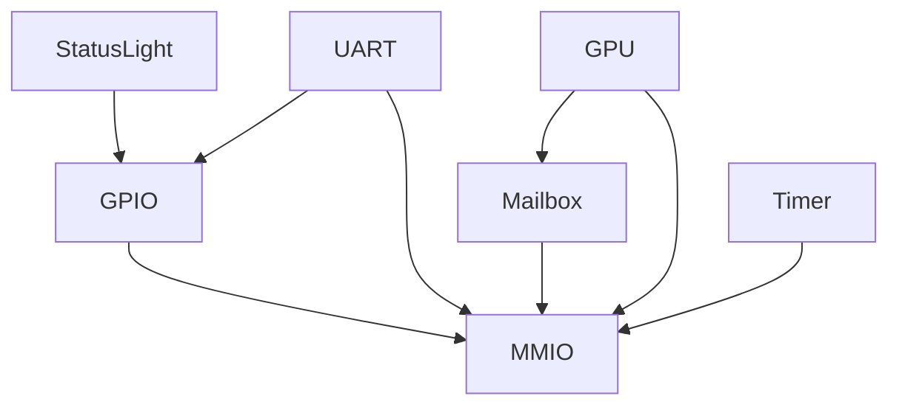
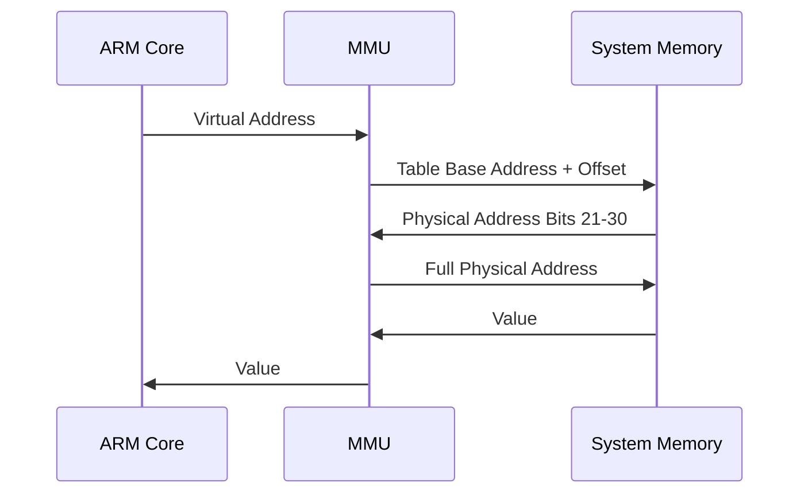
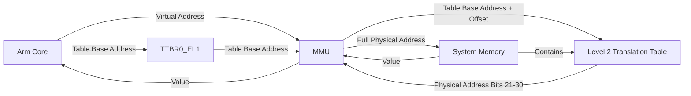

# Raspi-OS

A Raspberry Pi operating system.

## Table of Contents
- [Background](#background)
- [Outline](#outline)
- [Output to User](#output-to-user-1)
- [Hardware Abstraction](#hardware-abstraction-1)
- [Kernel](#kernel-1)
- [MMU](#mmu)
- [Acknowledgements](#acknowledgements)

## Background

The [Raspberry Pi](https://en.wikipedia.org/wiki/Raspberry_Pi) is a single board ARM computer equipped with modern peripherals as well as GPIO pins. Typically, a Raspberry Pi is used in conjunction with [Raspbian](https://en.wikipedia.org/wiki/Raspberry_Pi_OS) or another Linux distro, but since many of the components are open source, it is possible to write bare metal programs that are loaded directly by the firmware on startup.

I started Raspi-OS in the summer of 2021 because I wanted to learn more about systems programming. Originally, the project was conceived as a group effort, however, it quickly evolved into a personal endeavor. At this point, I have written or modified all of the code in the current codebase. So far, I have used the Raspberry Pi GPIO to operate LEDs; I have enabled UART communication with another computer; used a framebuffer to draw images to a screen; managed permissions through exception levels; initialized memory virtualization; and documented my progress here. I am currently working on an MMU API and custom scripting language. Raspi-OS is an ongoing project.

### Definitions

Since embedded development has a jargon of its own, especially with the use of abbreviations, a table of common ones is included below.
| Abbreviation | Term | Definition |
| :-: | :-: | :-: |
| **ARM** | [**A**dvanced **R**isc **M**achine](https://en.wikipedia.org/wiki/ARM_architecture_family) | A processor architecture designed on the principles of reduced instruction set computing |
| **EL**, **EL**n | [**E**xception **L**evel](https://developer.arm.com/documentation/102412/0103/Privilege-and-Exception-levels) | A hardware [CPU mode](https://en.wikipedia.org/wiki/CPU_modes) that enforces different privilege levels |
| **GPIO** | [**G**eneral **P**urpose **I**nput/**O**utput](https://en.wikipedia.org/wiki/General-purpose_input/output) | A hardware pin that may be controlled at runtime without a pre-assigned a specific purpose. |
| **MMIO** | [**M**emory-**M**apped **I**/**0**](https://en.wikipedia.org/wiki/Memory-mapped_I/O) | Hardware peripherals that are interfaced using registers that are mapped to the same address space as the system memory |
| **MMU** | [**M**emory **M**anagement **U**nit](https://en.wikipedia.org/wiki/Memory_management_unit) | A processor unit that controls caching and address translation for the system memory |
| **UART** | [**U**niversal **A**synchronous **R**eceiver-**T**ransmitter](https://en.wikipedia.org/wiki/Universal_asynchronous_receiver-transmitter) | A protocol which allows for bidirectional asynchronous communication between two parties.

## Outline

### User Input

Currently there are no input devices in development, however in the future buttons (easy) or USB devices (hard) may be used.

### Output to User

The user can receive output via a LED status light, a UART cable, or a monitor that is connected to the Raspberry Pi.

### Hardware Abstraction

When working with the low level features of the Pi, we should take care to separate the software interface from the hardware implementation. As a matter of good practice, this will give us more flexibility in the future, especially as more components become involved.

### Kernel

The purpose of the kernel is to load and run other programs and serve as an abstraction layer between the hardware features and the software implementations.

### Benchmarking
While common sense and theoretical models can provide guidance for design choices and component implementations, we should rely on runtime data as the ultimate arbiter of performance. To do this, we should write benchmarks for any potentially expensive algorithms and functions to have meaningful data on performance.

## Output to User

The Raspberry Pi's IO capabilities are detailed in the aptly named [BCM2835 ARM Peripherals](https://www.raspberrypi.org/app/uploads/2012/02/BCM2835-ARM-Peripherals.pdf) document.

### GPIO

The GPIO hardware of the Raspberry Pi 3 is described in part 6 of the BCM Peripherals documentation. The register file for the GPIO starts at an offset of `0x0020_0000` from the base MMIO address. Each pin has up to 8 possible functions which can be selected using a GPIO Function Select (`GPFSEL`) register. For our purposes, we can focus mainly on the output function. Once flagged as an output, each pin can be set high or cleared using its `GPSET` and `GPCLR` registers.

### UART
The Raspberry Pi implementation of UART is described in part 2 of the BCM documentation. Once connected, it allows for text communication between the Raspberry Pi and a connected computer which we can use for debugging and logging purposes.

### Display
Using the [Mailbox Property](https://github.com/raspberrypi/firmware/wiki/Mailbox-property-interface) interface, we can request a frame buffer from the Raspberry Pi VC GPU and treat it as a 2D array, with each index corresponding to a pixel.

## Hardware Abstraction
The main focus for our abstraction efforts is our API for interacting with hardware. As the hardware components become more complex, they begin to rely more on other components. For example, the UART controller relies on the MMIO controller, and GPIO controller, which itself relies on the MMIO controller again. By encapsulating each of these separate responsibilities, that is UART, GPIO, and MMIO in separate objects, we can create a logging interface that feels rather platform agnostic. The downside, of course, is that there are occasional repeated references. Such repetition is not enough to abandon our efforts at clean code, since the additional references do not take significantly more data and the occasional repetition is well worth the cleaner project structure.

I've included a diagram of hardware controller dependencies below. An arrow from a component to a component means that the first component relies on the second.



### Bitfields
[Bitfields](https://en.wikipedia.org/wiki/Bit_field) are a common design feature on the ARM platform. System registers often control multiple related aspects of the processor. The `EL1/0` Translation Control Register (`tcr_el1`) has bits that control translation granule size as well as bits that set cache properties. Efficiently modeling bitfield registers presents a challenge since Rust, unlike C lacks a built in bitfield structure. While there are multiple libraries that add bitfield support, it is easy to implement our own macro that allows us to construct bitfield interfaces that meet our needs. The `utils/bitfield.rs` module provides such functionality. For example, we could model a 32 bit color as follows:

```Rust
bitfield! {
    Color(u32) {
        a: 0-7,
        b: 8-15,
        g: 16-23,
        r: 24-32
    }
}
```

We would then be able to construct a `Color` object with the size of a `u32` with getter and setter functions for each field. Additionally, we can specify custom methods on the color object using a `with` directive:

```Rust
bitfield! {
    Color(u32) {
        a: 0-7,
        b: 8-15,
        g: 16-23,
        r: 24-32
    } with {
        const WHITE: Color = Color { value: 0xffffff00; }

        pub fn from_rgb(r: u32, g: u32, b: u32) -> Self {
            Self {
                value: (r << 24) | (g << 16) | (b << 8)
            }
        }
    }
}
```

### Registers
ARM uses registers to control essential processor features such as error handling, memory virtualization, and exception levels. We will take a two-level approach to abstracting register accesses and stores. First, registers can be defined using the `registers!` macro which builds on the bitfield API to create a fluent inferface for reading and writing to registers while hiding the use of assembler. Secondly, register use should be encapsulated by the component that requires the register. The MMU API should handle MMU registers and the user space api should handle the user space registers without the client needing to interact with the register objects themselves.

The `registers!` macro allows registers to be defined as follows:

```Rust
TranslationControlRegister("tcr_el1") {
    granule_size: 30-31,
    table_offset: 0-5
} with {
    pub enum GranuleSize {
        Kb4 = 0b10,
        Kb16 = 0b01,
        Kb64 = 0b11,
    }
}
```

Registers can then be modified in a fluent manner:

```Rust
TranslationControlRegister::read_to_buffer()
    .set_granule_size(TranslationControlRegister::GranuleSize::Kb4 as usize)
    .set_table_offset(33)
    .write_to_register();
```

## Kernel

### Privilege and Exception Levels
ARM, as a modern architecture, provides a hardware mechanism for managing the privileges of programs by providing 4 exception levels, `EL3`-`EL0`, with the higher number indicating increased privilege. Typically, kernels run in `EL1` while user-facing software runs in `EL0`. When our program is loaded it starts in `EL2`. For our purposes, we should enter `EL1`, especially for the purposes of configuring the memory management unit.

As the ARM documentation explains:
> The current level of privilege can only change when the processor takes or returns from an exception. Therefore, these privilege levels are referred to as exception levels in the ARM architecture.

This unfortunate naming scheme results in a mechanism for changing exception levels that seems rather hacky. An exception is "simulated" by populating the Saved Program Status Register (`spsr_el2`), and the Hypervisor Control Register (`hcr_el2`) with the values they would have on an actual exception and then pointing the Exception Link Register (`elr_el2`) to the target start of execution in `EL1`. Once this is done, we can "return" to `EL1` using the exception return (`eret`) instruction. Optionally, other registers can be populated with values to allow `EL1` programs to access certain processor features such as the FPU. This feels a little less hacky if we think of the exception link register (`elr`) and exception return instruction (`eret`) as analogs of the link register(`lr`) and return (`ret`) instruction and a change in exception level as another type of branch.

Further documentation can be found on the [ARM Website](https://developer.arm.com/documentation/102412/0102/Privilege-and-Exception-levels).

## MMU
When enabled, the ARM MMU manages the processor's cache and [memory virtualization](https://en.wikipedia.org/wiki/Memory_virtualization) with a nearly dangerous level of configurability, as described on the [website](https://developer.arm.com/documentation/101811/0102/The-Memory-Management-Unit-MMU), and in the [additional documentation](https://documentation-service.arm.com/static/5efa1d23dbdee951c1ccdec5?token=). The first choice we are faced with is the granule size, which is the smallest unit of memory in the translation process. ARM generously provides three options:  4KB, 16KB, and 64KB. Choosing the smallest option gives us the most granularity, and once the initialization process is understood, it is not too difficult to change. To indicate this selection, we write `0b10` to bits [31:30] of the translation control register (`tcr_el1`). A 4KB (or rather KiB) region contains 4096 = 2<sup>12</sup> bytes, meaning that the last 12 bytes of the virtual address are used for determining the offset within a granule. By the specification, each translation table contains up to 512 = 2<sup>9</sup> entries. As a result, with `n` tables and 4KiB granules, virtual addresses are `9n + 12` bits long. Since the Raspberry Pi 3 has 1GB, or 2<sup>30</sup> bytes of memory, 2 levels will suffice. We communicate this to the MMU by setting the `T0SZ` field of `tcr_el1` to 34, which is the amount from 64 we want to shrink the address space. Because we only have 2 levels of tables out of a maximum of 4, the first tables are considered level 2 tables. ARM allows level 1 and 2 table entries to point directly to blocks of memory by setting the second bit to `0`. Since we are creating a 1-to-1 mapping, this technique lets us skip the level 3 tables all together. Rather, each level 2 entry points to a 2MiB block, and bits `9 + 12 = 21` are used to determine the offset within the block. Armed with this plan, all we need to do is populate a 512 entry level 2 table. Each entry supplies bits 21-30 of the address. We mark the tenth bit to set the access flag and the first to mark the entry as valid. Once finished, we can point the Translation Table Base Register 0 (`ttbr0_el1`) to the start of the table, and activiate the MMU by writing a value of 1 to the first bit of the system control register (`sctlr_el1`).

I have included two diagrams that explain ARM memory virtualization. The first shows the interactions between the components involved in virtualization. The second lays out how a virtual address is lookup up.




Examples that I used in my development can be found [here](https://github.com/bztsrc/raspi3-tutorial/blob/master/10_virtualmemory/mmu.c) and [here](https://github.com/LdB-ECM/Raspberry-Pi/blob/master/10_virtualmemory/mmu.c). A Raspberry Pi forum discussion about these example and the ARM MMU in general can be found [here](https://forums.raspberrypi.com/viewtopic.php?t=227139).

## Acknowledgements

I am grateful for the mentorship that Tahmid Rahman has provided throughout this project.

I asked questions on Stack Overflow as [Someone](https://stackoverflow.com/users/7492736/someone) and on the Raspberry Pi forums as [SomeoneElse](https://forums.raspberrypi.com/memberlist.php?mode=viewprofile&u=378617).

I used a myriad of online examples and tutorials for inspiration and explanation of various components.

Sources I used:
- The University of Cambridge's [Baking Pi](https://www.cl.cam.ac.uk/projects/raspberrypi/tutorials/os/) tutorial
- The Rust on Embedded Devices Working Group's [Operating System development tutorial in Rust on the Raspberry Pi](https://github.com/rust-embedded/rust-raspberrypi-OS-tutorials). I used this tutorial as a starting point to structure my project.
- Zoltan Baldaszti's [Bare Metal Programming on the Raspberry pi 3](https://github.com/bztsrc/raspi3-tutorial/) tutorial. I modified a version of his boot code in `start.S` to change exception levels.
- Lowenware's [LeOS](https://github.com/lowenware/leos-kernel) and [blog post](https://lowenware.com/blog/aarch64-mmu-programming/), which I used to gain a better understanding of MMU programming.
- Philipp Opperman's blog posts about [CPU Expections](https://os.phil-opp.com/cpu-exceptions/) and [Allocator Designs](https://os.phil-opp.com/allocator-designs). My current allocator implementation follows his, however I plan on rewriting it soon to add my own defragmentation system.
- Adam Greenwood-Byrne's and Paul Wratt's [Raspberry Pi 4 bare metal tutorials](https://www.rpi4os.com/)
- [The OSDev Wiki](https://wiki.osdev.org/Main_Page)
- The [elinux.org RPi Framebuffer guide](https://elinux.org/RPi_Framebuffer)
- The Raspberry Pi firmware [Mailbox property interface guide](https://github.com/raspberrypi/firmware/wiki/Mailbox-property-interface)
- [The Official Raspberry Pi Forum](https://forums.raspberrypi.com/)
- [The Rust Spinlock Crate](https://docs.rs/spinlock/latest/spinlock/). I based my temporary spinlock off of this implementation, which seems quite common across examples.
- [The Rust Bitfield Crate](https://docs.rs/bitfield/latest/bitfield/index.html). I used this crate as an inspiration for my own somewhat different bitfield implementation.
